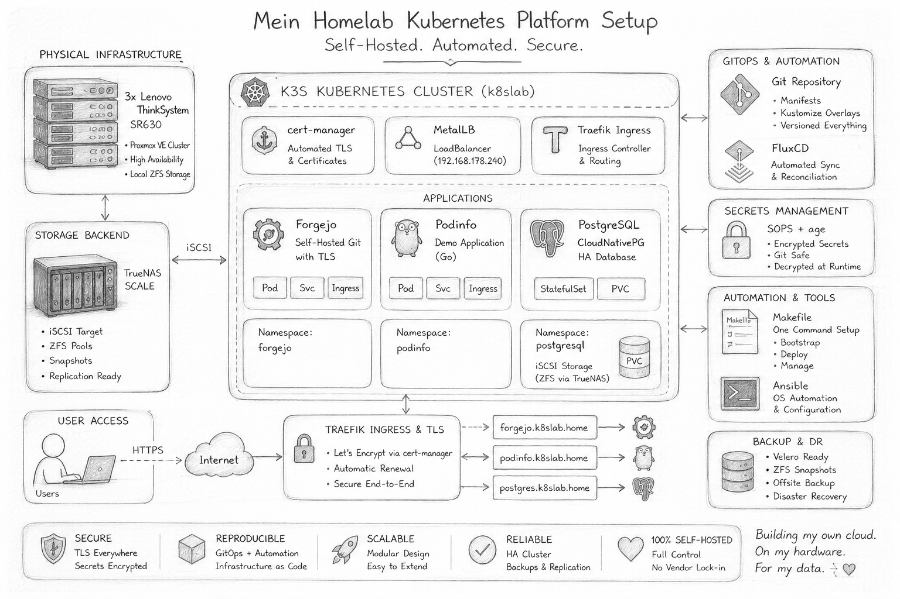

# Kubernetes Homelab

<p>
  
</p>

         
---

### Inhaltsverzeichnis

* [Cert Manager](infrastructure/cert-manager/README.md)
* [etcd - key-value store](infrastructure/etcd/README.md)
* [Podinfo Demo App](apps/podinfo/README.md)
* [PostgreSQL Server und TrueNAS ISCSI LUNs](apps/postgresql/README.md)
* [Forgejo Git Server](apps/forgejo/README.md)

---

## Beschreibung

Dieses Repository dokumentiert den Aufbau einer Kubernetes Testumgebung zu Lern- und Evaluierungszwecken.

Der Fokus hier liegt auf:
- Fedora CoreOS
- Kubernetes (k3s)
- Infrastructure Automation
- Cert-manager & TLS
- Traefik Ingress
- Multi Node Networking
- Storage Bereitstellung
- GitOps Grundlagen

Die Umgebung wurde vollständig automatisiert und basiert auf:<br>
Packer, Vagrant und Ansible

Der Kubernetes-Cluster besteht aus:
- 3 Control Plane Master Nodes mit embedded etcd
- 2 Worker Nodes

Ziel des Projekts ist es, praktische Erfahrungen mit Kubernetes, CoreOS, Container Orchestrierung sowie automatisierter Infrastruktur Provisionierung zu sammeln und typische Plattform Komponenten schrittweise selbst aufzubauen.

Um Zugriff auf das Kubernetes Cluster zu bekommen, benötigt man vorher die Kubernetes Client Konfigurationsdatei, diese wird dann im lokalen Verzeichnis unter `$HOME/.kube/config` abgelegt. 

```bash
# Kubernetes Client Konfigurationsdatei (API Zugriff) - Master Node
ssh core@192.168.56.10 'sudo cat /etc/rancher/k3s/k3s.yaml' | sed -e 's#https://127.0.0.1:6443#https://192.168.56.10:6443#' > "$HOME/.kube/config"

cat "$HOME/.kube/config
```

Danach kann man mit dem Tool `kubectl` oder `k9s` auf das Kubernetes Cluster zugreifen und die ersten Tests durchführen.

```bash
kubectl get nodes        
# NAME             STATUS   ROLES                AGE   VERSION
# coreos-master1   Ready    control-plane,etcd   20h   v1.36.5+k3s1
# coreos-master2   Ready    control-plane,etcd   20h   v1.36.5+k3s1
# coreos-master3   Ready    control-plane,etcd   19h   v1.36.5+k3s1
# coreos-worker1   Ready    <none>               19h   v1.36.5+k3s1
# coreos-worker2   Ready    <none>               19h   v1.36.5+k3s1

kubectl get namespaces 
# NAME              STATUS   AGE
# default           Active   18h
# kube-node-lease   Active   18h
# kube-public       Active   18h
# kube-system       Active   18h

kubectl get services
# NAME         TYPE        CLUSTER-IP   EXTERNAL-IP   PORT(S)   AGE
# kubernetes   ClusterIP   10.43.0.1    <none>        443/TCP   18h

# nginx demo pod anlegen und auf 3 pods erweitern
kubectl create deployment nginx --image=nginx
kubectl scale deployment nginx --replicas=3

kubectl get pods                                    
# NAME                     READY   STATUS    RESTARTS      AGE
# nginx-56c45fd5ff-7764h   1/1     Running   1 (80m ago)   19h
# nginx-56c45fd5ff-mvfvx   1/1     Running   1 (80m ago)   19h
# nginx-56c45fd5ff-v8npb   1/1     Running   1 (18h ago)   19h

kubectl describe svc nginx                 
# Name:                     nginx
# Namespace:                default
# Labels:                   app=nginx
# Annotations:              <none>
# Selector:                 app=nginx
# Type:                     NodePort
# IP Family Policy:         SingleStack
# ...

kubectl expose deployment nginx --port=80 --type=NodePort

kubectl get svc                                          
# NAME         TYPE        CLUSTER-IP    EXTERNAL-IP   PORT(S)        AGE
# kubernetes   ClusterIP   10.43.0.1     <none>        443/TCP        19h
# nginx        NodePort    10.43.39.44   <none>        80:30413/TCP   15s

curl http://192.168.56.11:30413
# <!DOCTYPE html>
# <html>
# <head>
# <title>Welcome to nginx!</title>
# ...

kubectl exec -it deploy/nginx -- sh

hostname
# nginx-56c45fd5ff-v8npb

ls -la
# total 4
# ...
# lrwxrwxrwx.   1 root root    7 May  8 16:10 bin -> usr/bin
# ...

## nginx Deployment und Service wieder löschen
kubectl get deployment
kubectl delete deployment nginx
kubectl get deployment

kubectl get services
kubectl delete svc nginx
kubectl get services
```

Um die Anwendungen zu deployen wurde ein `Makefile`erstellt, das die installation erleichtern soll.

```bash
make Makefile help
# Available targets:
#   make all
#   make bootstrap
#   make export-ca-certs
#   make deploy-podinfo
#   make deploy-postgresql
#  make deploy-forgejo

make Makefile all

kubectl get pods -A                               
# NAMESPACE      NAME                                       READY   STATUS      RESTARTS        AGE
# cert-manager   cert-manager-76ffbfcbfc-c7fjt              1/1     Running     1 (6h41m ago)   19h
# cert-manager   cert-manager-cainjector-6468bc96c7-wh4mc   1/1     Running     1 (6h40m ago)   19h
# cert-manager   cert-manager-webhook-558c6d4f4d-4t24r      1/1     Running     1 (6h41m ago)   19h
# cnpg-system    cnpg-cloudnative-pg-968f678b8-mg96z        1/1     Running     1 (18h ago)     19h
# forgejo        forgejo-59c66ffffd-mk7ql                   1/1     Running     1 (6h41m ago)   19h
# kube-system    coredns-7cfb7bc9c7-jlf44                   1/1     Running     2 (6h42m ago)   20h
# ...
# kube-system    svclb-traefik-9e86a69a-zn6v4               2/2     Running     4 (6h42m ago)   20h
# kube-system    traefik-7c8544f77-4x96m                    1/1     Running     2 (6h42m ago)   20h
# podinfo        podinfo-54995fdf8f-64dww                   1/1     Running     1 (6h40m ago)   19h
# podinfo        podinfo-54995fdf8f-fsvl4                   1/1     Running     1 (6h41m ago)   19h
# postgresql     forgejo-postgres-1                         1/1     Running     1 (6h41m ago)   19h
```
