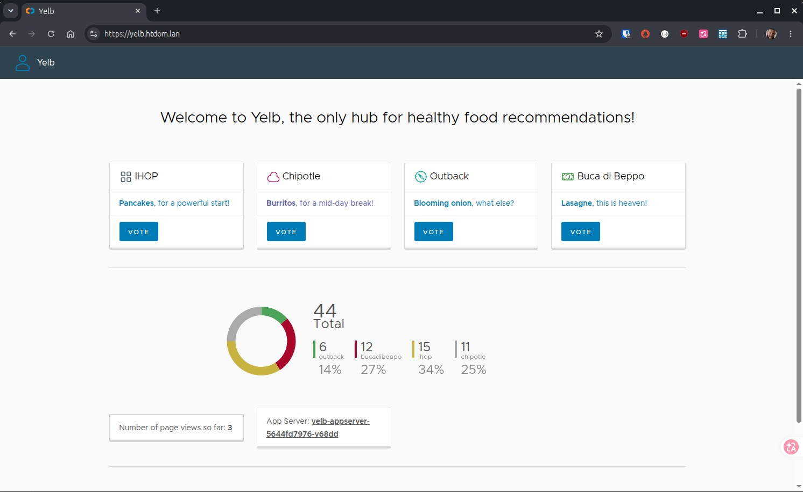

# yelb Demo Application

<p>
  
</p>

   

---

* [Yelb, yet another sample app](https://it20.info/2017/07/yelb-yet-another-sample-app/)
* [yelb Github Repo](https://github.com/mreferre/yelb)

---

[Back to home](../../README.md)

---

## Beschreibung

Yelb ist eine mehrschichtige Webanwendung zur Abstimmung über Restaurant-Empfehlungen. Dieses Projekt stellt Yelb auf einem selbst betriebenen Kubernetes-Cluster bereit und dient als praktisches Lernprojekt für Kubernetes-Administration, Anwendungsbereitstellung, persistenten Storage, Networking und Troubleshooting.

Das Deployment ist Bestandteil des Repositories `hth-kubernetes` und unterstützt die praktische Vorbereitung auf die Certified Kubernetes Administrator (CKA) Zertifizierung.

### Funktionen

- Kubernetes-native Bereitstellung der Anwendung
- PostgreSQL-Datenbank mit persistentem Storage
- Redis zur Speicherung der Page-View-Zähler
- Separater App Server mit REST-API
- Weboberfläche über Kubernetes Ingress
- TLS-Verschlüsselung mit cert-manager
- Verwaltung von Kubernetes Secrets mit SOPS
- Deklaratives Deployment mit Kustomize

## Architektur

Yelb besteht aus vier zentralen Komponenten:

| Komponente | Kubernetes-Ressource | Aufgabe |
|---|---|---|
| PostgreSQL | StatefulSet | Persistente Speicherung der Restaurant-Stimmen |
| Redis | Deployment | Speicherung der Page-View-Zähler |
| App Server | Deployment | REST-API und Anwendungslogik |
| UI | Deployment | Weboberfläche |

Jede Komponente wird intern über einen Kubernetes Service erreichbar gemacht.

```text
                         Browser
                            |
                            v
                  https://yelb.htdom.lan
                            |
                            v
                    Ingress Controller
                            |
                            v
                         yelb-ui
                            |
                            v
                     yelb-appserver
                       /          \
                      v            v
                    yelb-db    yelb-redis
                  PostgreSQL      Redis
```

### Anwendungsablauf

- Der Browser greift über den Ingress auf die Anwendung zu.
- Die UI kommuniziert über den Kubernetes Service `yelb-appserver` mit dem App Server.
- Der App Server speichert die Stimmen für die Restaurants in PostgreSQL.
- Der App Server zählt und liest die Seitenaufrufe über Redis.

## Umgebung

Die Anwendung läuft auf dem vorhandenen K3s-Cluster.

| Einstellung | Wert |
|---|---|
| Namespace | `yelb` |
| Kubernetes-Distribution | K3s |
| Anwendungs-URL | `https://yelb.htdom.lan` |
| Datenbank | PostgreSQL |
| Speicherung der Page Views | Redis |
| Ingress | Vorhandener Ingress Controller |
| TLS | cert-manager |
| Deployment-Methode | Kustomize |

Der Cluster besteht aus einem Control-Plane-Node und zwei Worker-Nodes. Der persistente Storage wird über die vorhandene Storage-Infrastruktur bereitgestellt.

## Repository-Struktur

Die relevanten Dateien sind folgendermaßen organisiert:

```text
apps/yelb/
├── namespace.yaml
├── kustomization.yaml
├── db/
│   ├── persistent-volume.yaml
│   ├── persistent-volume-claim.yaml
│   ├── service.yaml
│   └── statefulset.yaml
├── redis/
│   ├── configmap.yaml
│   ├── deployment.yaml
│   └── service.yaml
├── app/
│   ├── deployment.yaml
│   └── service.yaml
└── ui/
    ├── deployment.yaml
    ├── service.yaml
    ├── ingress.yaml
    └── certificate.yaml

secrets/
└── yelb-db-secret.yaml
```

Das Datenbank-Secret wird separat mit SOPS verschlüsselt gespeichert. Der tatsächliche Speicherort kann abhängig von der Bootstrap-Konfiguration des Repositories abweichen.

## Voraussetzungen

Vor dem Deployment müssen folgende Voraussetzungen erfüllt sein:

- Funktionsfähiger Kubernetes-Cluster
- Konfiguriertes `kubectl`
- Kustomize-Unterstützung über `kubectl`
- Konfiguriertes SOPS zum Entschlüsseln des Datenbank-Secrets
- Vorhandener Ingress Controller
- Installiertes cert-manager mit passendem Certificate Issuer
- Konfigurierter persistenter Storage für PostgreSQL
- Funktionierende DNS-Auflösung für `yelb.htdom.lan`

Cluster-Verbindung prüfen:

```bash
kubectl get nodes
kubectl get pods -A
```

## Deployment

Die Anwendung wird über die Kubernetes-Manifeste in `apps/yelb/` verwaltet.

Die Datenbank muss verfügbar sein, bevor der App Server auf sie zugreifen kann. Die UI benötigt einen erreichbaren App Server.

### 1. Namespace erstellen

Der Namespace ist in folgender Datei definiert:

```text
apps/yelb/namespace.yaml
```

Die Kustomize-Konfiguration berücksichtigt die Namespace-Definition.

### 2. PostgreSQL bereitstellen

Die PostgreSQL-Datenbank läuft als StatefulSet.

Relevante Ressourcen:

- StatefulSet: `yelb-db`
- Pod: `yelb-db-0`
- Service: `yelb-db`
- PersistentVolume: `yelb-pv-worker1`
- PersistentVolumeClaim: `yelb-pvc-worker1`
- Secret: `yelb-db-secret`

Die Datenbank verwendet PostgreSQL 15 und persistenten Storage.

Die Zugangsdaten werden über das Kubernetes Secret `yelb-db-secret` bereitgestellt.

| Einstellung | Wert |
|---|---|
| Datenbank | `yelbdatabase` |
| Benutzer | `postgres` |
| Passwort | Wird über das Secret bereitgestellt |

Das Passwort muss mit der Konfiguration des App Servers übereinstimmen.

Datenbankressourcen überprüfen:

```bash
kubectl get statefulset,pod,service -n yelb
kubectl get pv,pvc
kubectl logs -n yelb yelb-db-0
```

#### Datenbankschema initialisieren

Die Restaurant-Tabelle muss existieren, bevor Stimmen gespeichert werden können. Im aktuellen Deployment wurde das Schema manuell in PostgreSQL angelegt.

Mit der Datenbank verbinden:

```bash
kubectl exec -it -n yelb yelb-db-0 -- \
  psql -U postgres -d yelbdatabase
```

Tabelle erstellen und Restaurant-Datensätze anlegen:

```sql
CREATE TABLE restaurants (
    name CHAR(30) PRIMARY KEY,
    count INTEGER
);

INSERT INTO restaurants (name, count) VALUES
    ('outback', 0),
    ('bucadibeppo', 0),
    ('chipotle', 0),
    ('ihop', 0);
```

Daten überprüfen:

```sql
SELECT name, count FROM restaurants;
```

PostgreSQL verlassen:

```sql
\q
```

**Wichtig:** Die Initialisierung des Schemas ist beim aktuellen Deployment ein manueller Einzelschritt. Sie wird nicht automatisch durch die Kubernetes-Manifeste ausgeführt. Wird die Datenbank mit einem leeren Datenverzeichnis neu initialisiert, muss das Schema erneut angelegt werden.

### 3. Redis bereitstellen

Redis wird zur Speicherung der Page-View-Zähler verwendet.

Relevante Ressourcen:

- Deployment: `yelb-redis`
- Service: `yelb-redis`
- ConfigMap: `redis-config`

Redis ist intern über TCP-Port `6379` erreichbar.

Deployment und Service überprüfen:

```bash
kubectl get deployment,pod,service -n yelb
kubectl get endpoints yelb-redis -n yelb
kubectl logs -n yelb deployment/yelb-redis
```

Der App Server muss den korrekten Namen des Redis Service verwenden.

Die erwartete Umgebungsvariable lautet:

```yaml
- name: REDIS_SERVER_ENDPOINT
  value: yelb-redis
```

Wird der Redis Service umbenannt, muss diese Einstellung entsprechend angepasst werden.

### 4. App Server bereitstellen

Der App Server stellt die REST-API und die Anwendungslogik bereit. Er kommuniziert mit PostgreSQL und Redis.

Relevante Ressourcen:

- Deployment: `yelb-appserver`
- Service: `yelb-appserver`
- Container-Port: `4567`

Die Anwendung verwendet folgende Umgebungsvariablen:

```yaml
- name: RACK_ENV
  value: custom
- name: REDIS_SERVER_ENDPOINT
  value: yelb-redis
- name: YELB_DB_SERVER_ENDPOINT
  value: yelb-db
```

Die Datenbankverbindung einschließlich Datenbankname und Zugangsdaten wird durch die Anwendungskonfiguration festgelegt.

Deployment überprüfen:

```bash
kubectl rollout status deployment/yelb-appserver -n yelb
kubectl get pods,service -n yelb
kubectl logs -n yelb deployment/yelb-appserver
```

### 5. UI bereitstellen

Die UI stellt die Weboberfläche für den Browser bereit.

Relevante Ressourcen:

- Deployment: `yelb-ui`
- Service: `yelb-ui`
- Ingress: `yelb.htdom.lan`
- TLS-Secret: `yelb-pki-secret`

Die UI kommuniziert über den Kubernetes Service `yelb-appserver` mit dem App Server.

UI und Ingress überprüfen:

```bash
kubectl rollout status deployment/yelb-ui -n yelb
kubectl get pods,service,ingress -n yelb
kubectl describe ingress -n yelb
```

Zertifikat überprüfen:

```bash
kubectl get certificate -n yelb
kubectl get secret yelb-pki-secret -n yelb
```

Die Anwendung ist anschließend unter folgender URL erreichbar:

```text
https://yelb.htdom.lan
```

DNS-Auflösung, Ingress Controller und Certificate Issuer müssen bereits im Cluster konfiguriert sein.

## Gesamtes Deployment ausführen

Nachdem das Secret entschlüsselt und angewendet wurde, können die Ressourcen über Kustomize bereitgestellt werden.

Vom Repository-Root aus:

```bash
kubectl apply -k ./apps/yelb/
```

Alternativ kann das Makefile-Target `make deploy-yelb` verwendet werden, sofern es entsprechend konfiguriert ist und die erforderlichen Bootstrap-Schritte ausgeführt werden.

Deployment überprüfen:

```bash
kubectl get all -n yelb
kubectl get pv,pvc
kubectl get ingress,certificate -n yelb
```

Auf die Bereitschaft der Workloads warten:

```bash
kubectl rollout status statefulset/yelb-db -n yelb
kubectl rollout status deployment/yelb-redis -n yelb
kubectl rollout status deployment/yelb-appserver -n yelb
kubectl rollout status deployment/yelb-ui -n yelb
```

**Hinweis:** Die Initialisierung des Datenbankschemas bleibt ein separater Schritt, wenn die Datenbank mit einem leeren Datenverzeichnis gestartet wird.

## Verifikation und Tests

### 1. Anwendung im Browser prüfen

Folgende URL öffnen:

```text
https://yelb.htdom.lan
```

Folgende Punkte überprüfen:

- Die UI wird erfolgreich über HTTPS geladen.
- Alle vier Restaurants werden angezeigt.
- Die Abstimmungsbuttons funktionieren.
- Das Diagramm zeigt die aktuellen Stimmenzahlen.
- Die Gesamtzahl der Stimmen ist korrekt.
- Der Page-View-Zähler wird angezeigt.
- Der Hostname des App Servers wird angezeigt.

### 2. Kubernetes-Ressourcen überprüfen

```bash
kubectl get pods -n yelb -o wide
kubectl get services -n yelb
kubectl get endpoints -n yelb
```

Alle erforderlichen Pods sollten bereit sein. Die Services müssen die erwarteten Endpoints besitzen.

### 3. App-Server-API testen

Den Port des App Servers auf den lokalen Rechner weiterleiten:

```bash
kubectl port-forward -n yelb service/yelb-appserver 4567:4567
```

Diesen Befehl in einem Terminal laufen lassen. Die API-Tests in einem zweiten Terminal ausführen.

Stimmenstatistik abrufen:

```bash
curl -i http://localhost:4567/api/getvotes
```

Anwendungsstatistik abrufen:

```bash
curl -i http://localhost:4567/api/getstats
```

Einzelnen Restaurant-Endpunkt testen:

```bash
curl -i http://localhost:4567/api/ihop
```

Wenn die Anwendung und ihre Abhängigkeiten korrekt funktionieren, sollten die Endpunkte HTTP-200-Antworten zurückgeben.

**Hinweis:** Der Aufruf eines Restaurant-Endpunkts kann die Stimmenzahl erhöhen. Diesen Test nur ausführen, wenn eine Änderung der Daten akzeptabel ist.

### 4. Redis-Verbindung überprüfen

Prüfen, ob der Redis Service einen Endpoint besitzt:

```bash
kubectl get endpoints yelb-redis -n yelb
```

Redis-Logs prüfen:

```bash
kubectl logs -n yelb deployment/yelb-redis --tail=60
```

Der Redis-Server sollte melden, dass er bereit ist, TCP-Verbindungen anzunehmen.

### 5. PostgreSQL-Daten überprüfen

```bash
kubectl exec -it -n yelb yelb-db-0 -- \
  psql -U postgres -d yelbdatabase \
  -c "SELECT name, count FROM restaurants;"
```

Die Abfrage sollte alle vier Restaurant-Datensätze mit ihren aktuellen Stimmenzahlen zurückgeben.

## Troubleshooting

### App Server kann Redis nicht erreichen

Mögliche Symptome sind HTTP-500-Antworten von `/api/getstats` und Redis-Verbindungsfehler in den App-Server-Logs.

Umgebungsvariablen prüfen:

```bash
kubectl get deployment yelb-appserver -n yelb \
  -o jsonpath='{.spec.template.spec.containers[0].env}'
```

Redis Service und Endpoints prüfen:

```bash
kubectl get services -n yelb
kubectl get endpoints yelb-redis -n yelb
```

Der App Server muss den tatsächlich vorhandenen Service-Namen verwenden:

```yaml
- name: REDIS_SERVER_ENDPOINT
  value: yelb-redis
```

Nach einer Änderung am Manifest die Konfiguration anwenden und auf den erfolgreichen Rollout warten:

```bash
kubectl apply -f apps/yelb/app/deployment.yaml

kubectl rollout status deployment/yelb-appserver -n yelb
```

Anschließend die API erneut testen:

```bash
curl -i http://localhost:4567/api/getstats
```

**Erkenntnis:** Das Umbenennen eines Kubernetes Service aktualisiert nicht automatisch die Umgebungsvariablen abhängiger Deployments. Die Service Discovery funktioniert nur, wenn die Anwendung den korrekten Service-Namen verwendet.

### App Server liefert HTTP 500

Anwendungslogs untersuchen:

```bash
kubectl logs -n yelb deployment/yelb-appserver --tail=100
```

Datenbank- und Redis-Endpoints überprüfen:

```bash
kubectl get endpoints yelb-db yelb-redis -n yelb
```

Prüfen, ob das Datenbankschema vorhanden ist und ob Datenbankname und Zugangsdaten mit der Anwendungskonfiguration übereinstimmen.

Die API direkt über Port Forwarding testen. So lassen sich Probleme der Anwendung von Problemen mit Ingress oder UI unterscheiden.

### PostgreSQL läuft, aber Abstimmungen funktionieren nicht

Datenbanklogs untersuchen:

```bash
kubectl logs -n yelb yelb-db-0
```

Tabellen überprüfen:

```bash
kubectl exec -it -n yelb yelb-db-0 -- \
  psql -U postgres -d yelbdatabase \
  -c "\dt"
```

Fehlt die Tabelle `restaurants`, muss das Schema wie im Abschnitt zur Datenbankinitialisierung beschrieben angelegt werden.

### UI wird geladen, aber Statistiken fehlen

Zuerst den App Server prüfen:

```bash
curl -i http://localhost:4567/api/getstats
curl -i http://localhost:4567/api/getvotes
```

Liefert die API einen Fehler, sollten zuerst die App-Server-Logs und die Endpoints der Abhängigkeiten untersucht werden, bevor UI oder Ingress analysiert werden.

### Pod ist nicht bereit

```bash
kubectl get pods -n yelb -o wide
kubectl describe pod -n yelb <pod-name>
kubectl get events -n yelb --sort-by=.lastTimestamp
```

Die Ausgaben helfen dabei, Image-Pull-Fehler, fehlgeschlagene Probes, Scheduling-Probleme, Storage-Probleme oder Fehler beim Containerstart zu identifizieren.

## Sicherheitshinweise

- Datenbankzugangsdaten werden als Kubernetes Secret verwaltet und im Repository mit SOPS verschlüsselt gespeichert.
- Entschlüsselte Secrets und Klartext-Zugangsdaten dürfen nicht ins Repository eingecheckt werden.
- Redis verwendet im aktuellen Deployment keine Authentifizierung und sollte nur innerhalb des vertrauenswürdigen Cluster-Netzwerks erreichbar sein.
- Die Komponenten kommunizieren intern über Kubernetes Services.
- TLS wird am Ingress terminiert.

Für einen produktiven Betrieb sollten insbesondere Redis-Authentifizierung, Netzwerkbeschränkungen, Ressourcenanforderungen und -limits, Storage-Backups sowie das Secret-Management überprüft werden.

## Aufräumen

Die Anwendungsressourcen können über Kustomize entfernt werden:

```bash
kubectl delete -k ./apps/yelb/
```

**Warnung:** Vor dem Löschen müssen die Reclaim Policy des PersistentVolume und die Storage-Konfiguration geprüft werden. Das aktuelle PostgreSQL-PersistentVolume verwendet `Retain`. Das Löschen von Kubernetes-Ressourcen entfernt daher nicht zwangsläufig die zugrunde liegenden Daten.

Sollen die Daten erhalten bleiben, müssen der Zustand von PV und PVC sowie die tatsächlichen Datenverzeichnisse vor dem Aufräumen überprüft werden.

## Erkenntnisse aus dem Projekt

Das Deployment vermittelt praktische Erfahrung mit:

- Deployments, StatefulSets und Pods
- Kubernetes Services und DNS-basierter Service Discovery
- PersistentVolumes und PersistentVolumeClaims
- Kubernetes Secrets und SOPS
- ConfigMaps und Umgebungsvariablen
- Ingress und TLS-Zertifikaten
- REST-API-Fehlersuche
- Analyse von Anwendungslogs und Kubernetes Events
- Fehlerdiagnose bei Service-Endpoints und Abhängigkeiten
- Trennung von Anwendungsfehlern und Kubernetes-Netzwerkproblemen

Die wichtigste Erkenntnis aus dem Troubleshooting war, die gesamte Abhängigkeitskette zu überprüfen:

`UI → App Server → PostgreSQL und Redis`

Ein Pod kann laufen und bereit sein, obwohl eine benötigte Anwendungsabhängigkeit noch falsch konfiguriert ist. Durch direkte API-Tests, die Überprüfung der Service-Endpoints und die Analyse der Anwendungslogs konnten die Fehler eingegrenzt und behoben werden.

---

**Status:** Yelb läuft erfolgreich im K3s-Cluster. Die Abstimmungen, die PostgreSQL-Datenspeicherung, die Page-View-Statistik über Redis, die Anzeige des App Servers und die HTTPS-Weboberfläche wurden erfolgreich überprüft.